#  PrepPilot AI
> An AI-powered study companion for planning, practicing, organizing, and tracking your learning journey.

PrepPilot AI is a full-stack AI-powered learning platform designed for students preparing for competitive exams, academic subjects, and technical interviews.

The platform combines AI-powered study planning, quiz generation, AI notes, calendar planning, authentication, and progress analytics into one unified application.

##  Live Demo

### Frontend

https://prep-pilot-ai-m2ec.vercel.app

### Backend API

https://preppilot-ai-bvbn.onrender.com

### API Documentation

https://preppilot-ai-bvbn.onrender.com/docs


##  Screenshots

> Add your project screenshots inside `docs/screenshots/` and update the filenames below if required.

### Login Page

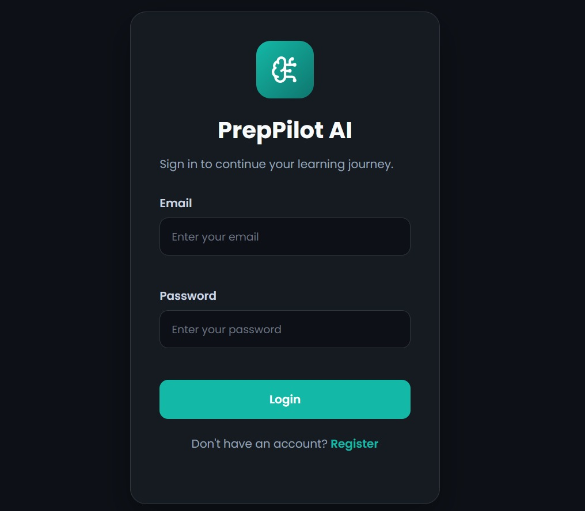

### Dashboard

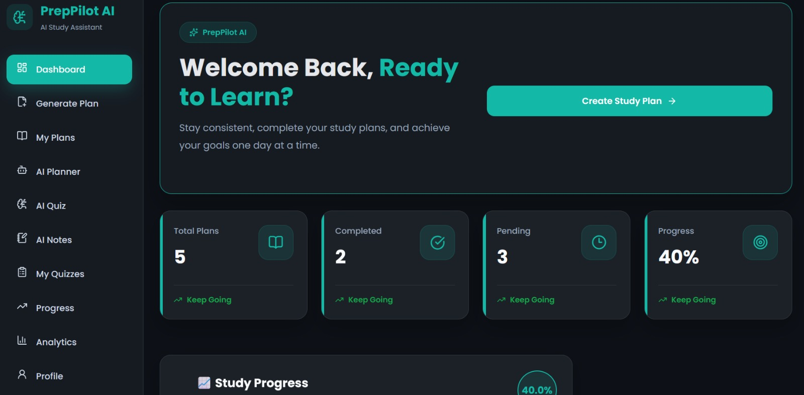

### AI Planner

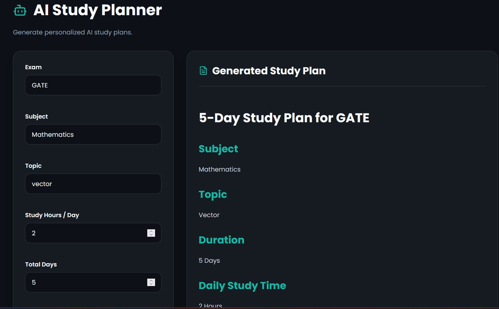

### AI Quiz Generator

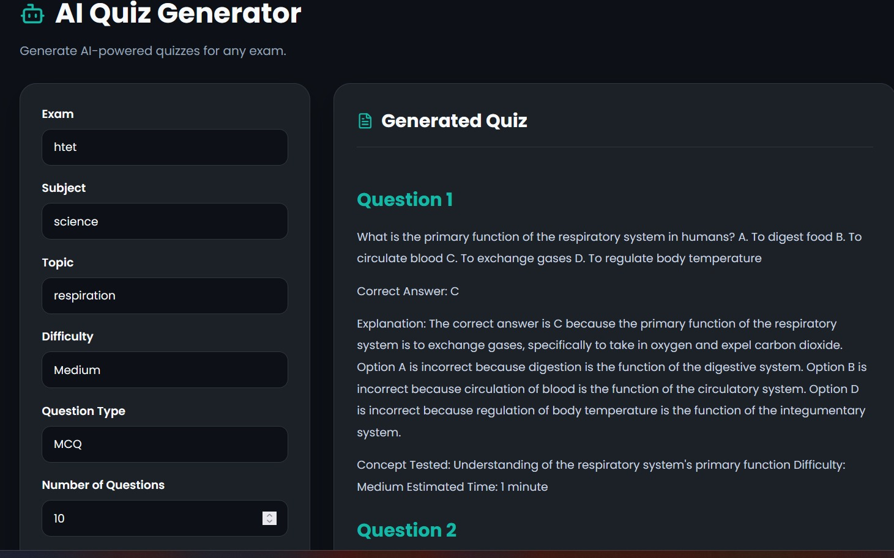

### My Quizzes

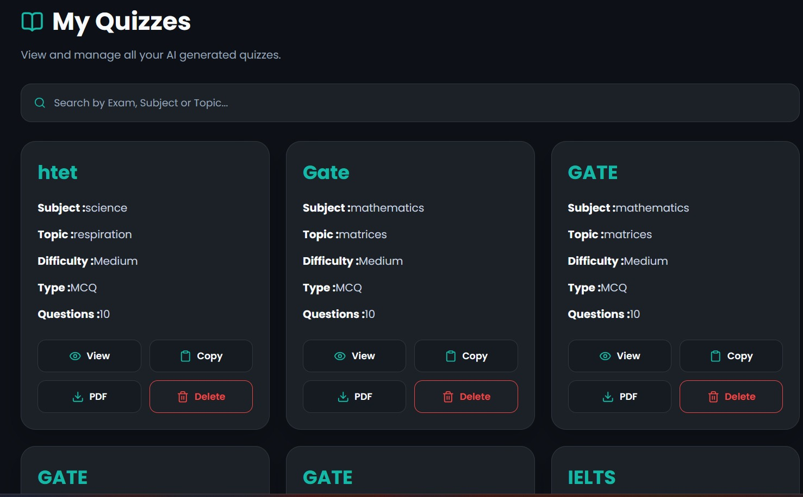

### AI Notes

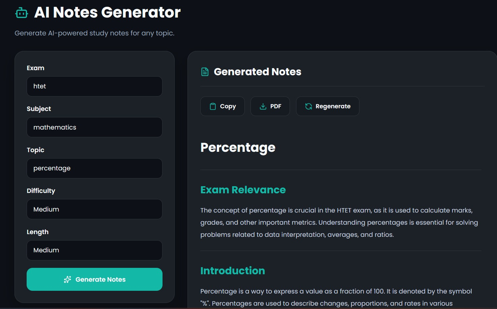

### Calendar

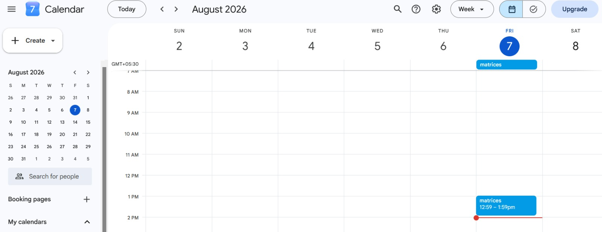

### Progress Tracker

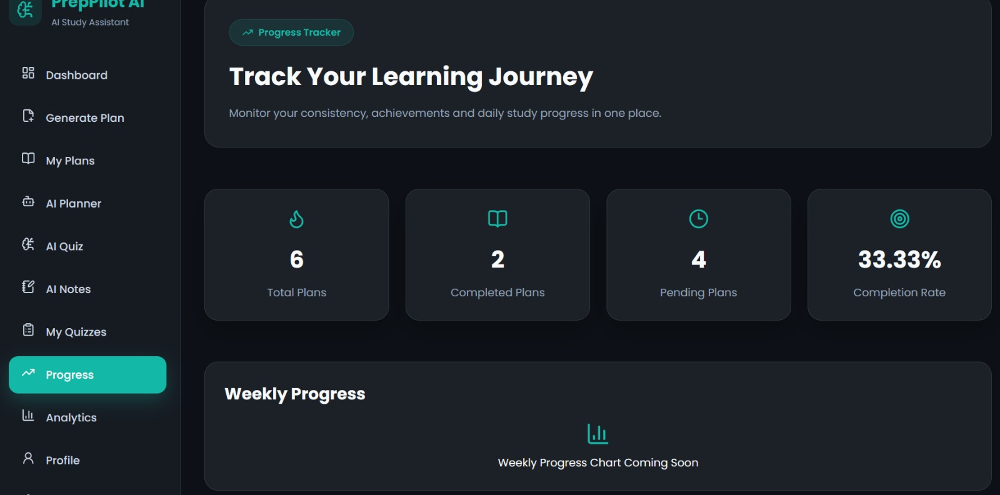

### Settings

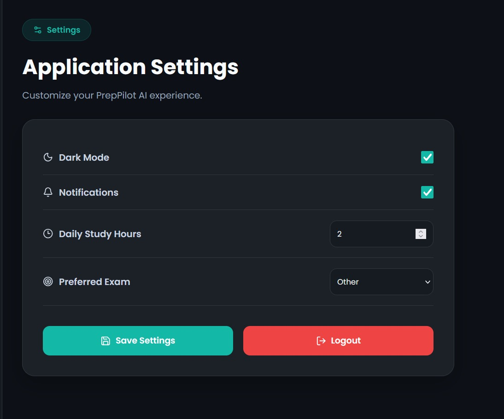

### Analytics

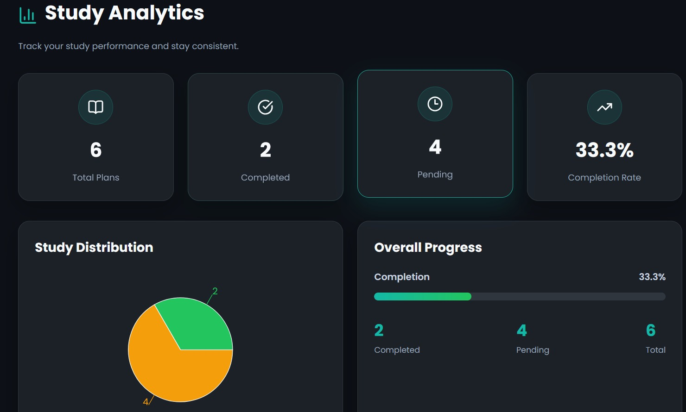

### Profile Page

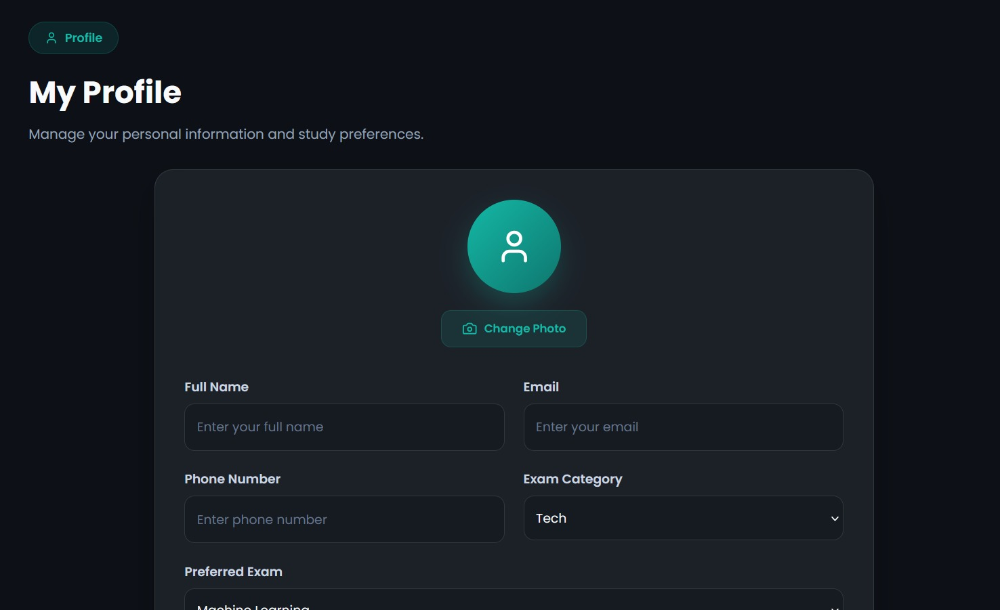

### Study Plan

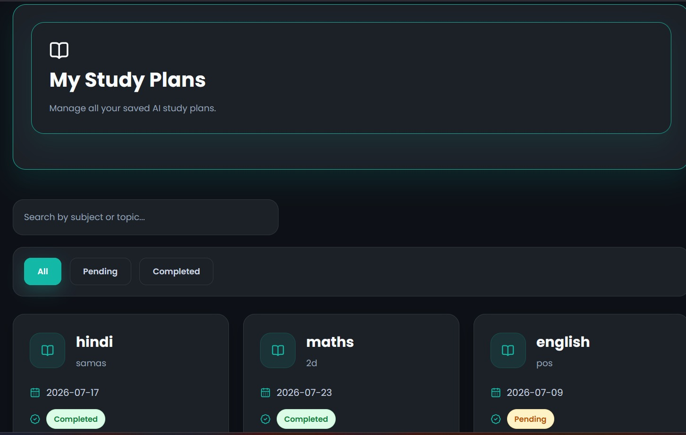

### API Documentation

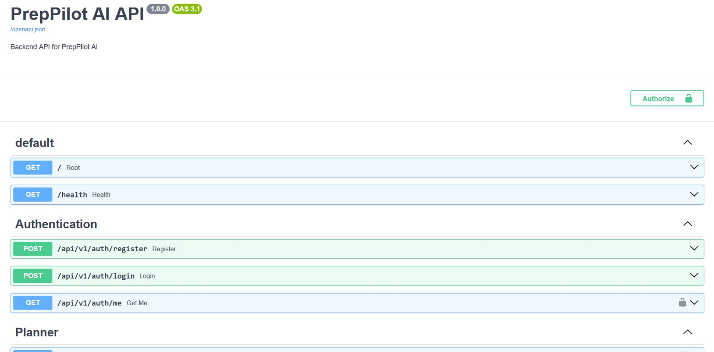

#  Features

##  Authentication

PrepPilot AI provides secure user authentication and protected application routes.

Features include:

- User registration
- User login
- JWT-based authentication
- Password hashing
- Protected API routes
- Automatic token handling
- Token validation
- Logout functionality
- User-specific data access

##  AI Study Planner

Create personalized study plans based on learning goals.

Users can generate study plans based on:

- Target exam
- Subject
- Topic
- Study requirements

### Planner capabilities

- AI-generated study plans
- Manual study plan creation
- Save AI-generated plans
- Update plans
- Delete plans
- Pending / Completed status
- User-specific plans
- Study date tracking

##  AI Quiz Generator

Generate customized quizzes using AI.

Users can configure:

- Exam
- Subject
- Topic
- Difficulty
  - Easy
  - Medium
  - Hard
- Question type
  - MCQ
  - True / False
  - Short Answer
- Number of questions

### Quiz actions

- Generate quiz
- Regenerate quiz
- Copy quiz
- Clear quiz
- Download quiz as PDF

##  My Quizzes

Manage previously generated quizzes from a centralized interface.

Users can:

- View saved quizzes
- Search quizzes
- Copy quizzes
- Download quizzes
- Delete quizzes

##  AI Notes

Generate AI-powered study notes for selected subjects and topics.

The AI Notes module helps students:

- Generate revision material
- Organize learning content
- Quickly review topics
- Create concise study resources

##  Calendar Planning

PrepPilot AI allows users to organize study plans around their calendar.

Supported calendar functionality includes:

- Google Calendar
- Outlook Calendar
- `.ics` calendar files

This allows study plans to be converted into calendar events and integrated into the user's existing schedule.

##  Progress Tracker

The Progress Tracker provides statistics based on the user's study activity.
It tracks:

- Total study plans
- Pending plans
- Completed plans
- Completion percentage
- Study hours
- Day streak
- Goal completion
- Weekly progress

### Weekly analytics

The weekly progress section tracks:

- Planned study tasks
- Completed study tasks

This gives users a quick overview of their weekly consistency and productivity.

##  Achievements

PrepPilot AI includes progress-based achievements to encourage consistent study habits.

Achievements can be displayed based on user activity and study progress.

##  Settings

Users can manage application preferences including:

- Dark mode
- Notifications
- Daily study hours
- Preferred exam
- Saved preferences
- Logout

#  Application Architecture

                         ┌───────────────────┐
                         │       User        │
                         └─────────┬─────────┘
                                   │
                                   ▼
                         ┌───────────────────┐
                         │  React + Vite     │
                         │     Frontend      │
                         │     Vercel        │
                         └─────────┬─────────┘
                                   │
                              REST API
                                   │
                                   ▼
                         ┌───────────────────┐
                         │     FastAPI       │
                         │      Backend      │
                         │      Render       │
                         └─────────┬─────────┘
                                   │
                 ┌─────────────────┼─────────────────┐
                 │                 │                 │
                 ▼                 ▼                 ▼
        ┌────────────────┐ ┌──────────────┐ ┌─────────────────┐
        │  PostgreSQL    │ │   Groq / AI  │ │ Authentication  │
        │    Database    │ │    Services  │ │      JWT        │
        └────────────────┘ └──────────────┘ └─────────────────┘

## Tech Stack

## Frontend

- React
- Vite
- React Router DOM
- Axios
- Recharts
- React Toastify
- html2pdf.js
- ics
- file-saver

## Backend

- Python
- FastAPI
- SQLAlchemy
- Pydantic
- JWT Authentication
- python-jose
- pwdlib
- Argon2
- psycopg2

## Database

- SQLite for local development
- PostgreSQL for production

## AI

- Groq
- Google Generative AI

## Deployment

- Vercel — Frontend
- Render — Backend
- PostgreSQL — Production Database

# Project Structure
```text
PrepPilot-AI/
│
├── backend/
│   ├── app/
│   │   ├── api/
│   │   │   ├── v1/
│   │   │   └── router.py
│   │   ├── core/
│   │   ├── models/
│   │   ├── schemas/
│   │   ├── services/
│   │   ├── config.py
│   │   ├── database.py
│   │   ├── main.py
│   │   └── __init__.py
│   └── requirements.txt
│
├── frontend/
│   ├── public/
│   ├── src/
│   ├── package.json
│   ├── package-lock.json
│   ├── vite.config.js
│   └── index.html
│
├── docs/
│   └── screenshots/
│
├── README.md
└── .gitignore
```

###  API Modules

The FastAPI backend provides APIs for:

- Authentication
- Planner management
- Dashboard statistics
- AI study planning
- Quiz generation
- Notes generation
- User-specific data

Main API prefixes include:

- `/api/v1/auth`
- `/api/v1/planner`
- `/api/v1/ai`
- `/api/v1/quiz`
- `/api/v1/notes`

Interactive API documentation:

https://preppilot-ai-bvbn.onrender.com/docs

# Authentication Flow

PrepPilot AI uses JWT-based authentication.
```text
User
 │
 ▼
Register / Login
 │
 ▼
FastAPI Authentication API
 │
 ▼
Credential Verification
 │
 ▼
JWT Access Token
 │
 ▼
Frontend localStorage
 │
 ▼
Authorization: Bearer <token>
 │
 ▼
Protected API Routes
```

###  Environment Variables

Create a `.env` file inside the `backend` directory.
```env
GEMINI_API_KEY=your_gemini_api_key
GROQ_API_KEY=your_groq_api_key
SECRET_KEY=your_jwt_secret_key
DATABASE_URL=your_database_url
```

###  Running the Application

## Start Backend
cd backend
uvicorn app.main:app --reload

###  Production Deployment

PrepPilot AI is deployed as a full-stack application.

## Frontend

Deployed using Vercel:

https://prep-pilot-ai-m2ec.vercel.app

## Backend

Deployed using Render:

https://preppilot-ai-bvbn.onrender.com

## API Documentation

https://preppilot-ai-bvbn.onrender.com/docs

## Production Database

PostgreSQL is used as the production database.

The frontend communicates with the production backend through:

https://preppilot-ai-bvbn.onrender.com/api/v1

# Future Enhancements

- Advanced AI personalization
- Adaptive quiz difficulty
- AI-based performance analysis
- Advanced learning analytics
- Smarter study recommendations
- More calendar integrations
- Export/import of study plans
- Notifications and reminders
- Collaborative classroom mode
- Improved mobile experience

### License

This project is currently intended for educational and personal development purposes.
